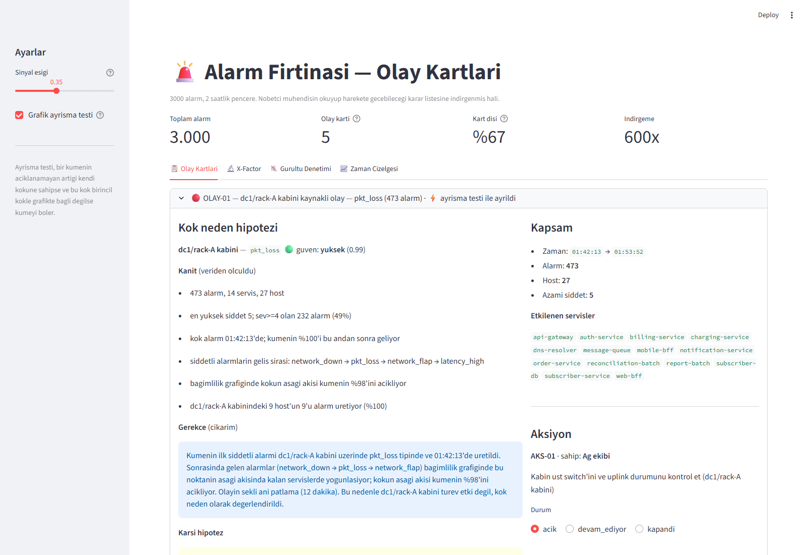
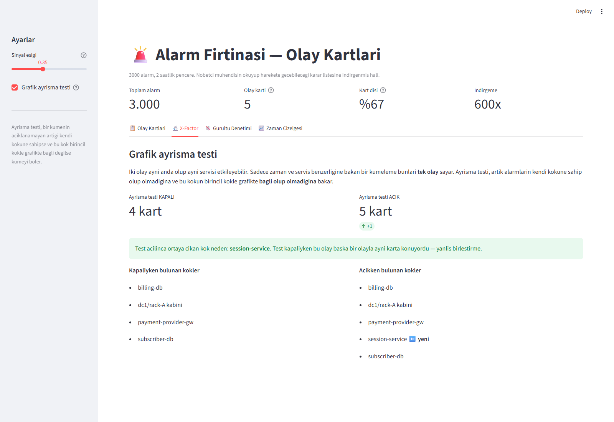
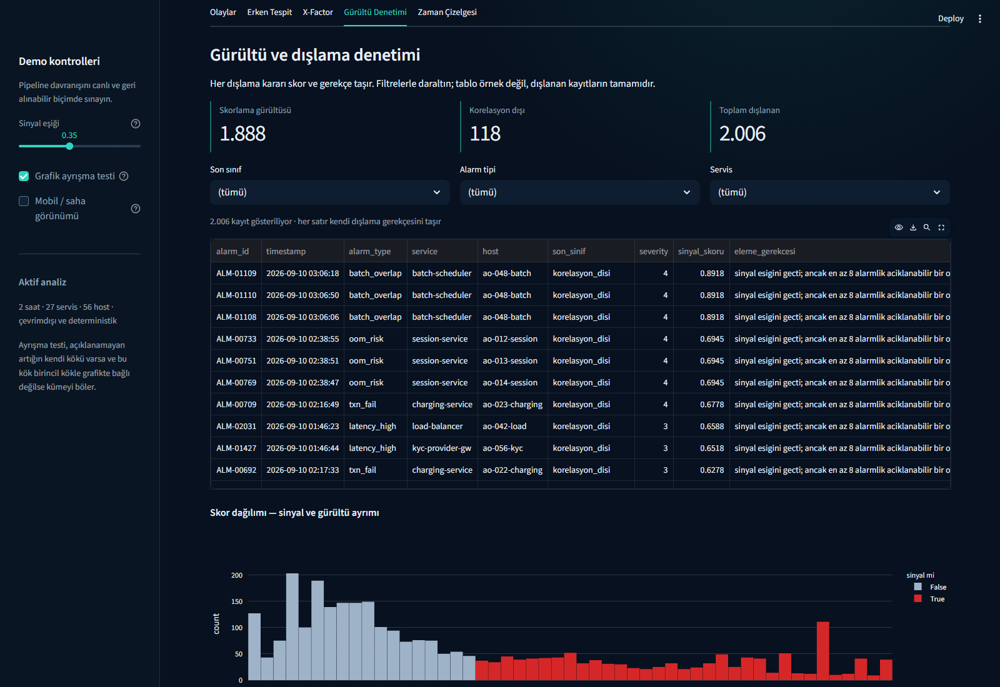

# Alarm Fırtınası → Olay Kartları

**Takım:** Fail-i Over · **Senaryo:** AO Hackathon 2026 · S-A1

İki saatlik pencerede gelen 3000 alarmı, nöbetçi mühendisin okuyup harekete
geçebileceği **5 olay kartına** indirger; her kartın kök neden hipotezini
kanıtı, gerekçesi ve karşı hipoteziyle birlikte gösterir.

---

## Çözülen problem

Alarm ekranındaki güçlük sayı değil, **neden-sonuç ilişkisinin görünmemesi**.
Hangi alarmın kök neden, hangisinin türev etki, hangisinin bağımsız gürültü
olduğu ayırt edilemediği için müdahale sırası yanlış kurulur.

Bu yüzden çözüm bir filtre değil, bir **nedensellik atfetme** aracı:

```
3000 alarm → 1888 skor gürültüsü + 118 korelasyon dışı sinyal →
994 karta atanmış alarm → 5 olay kartı
```

---

## Nasıl çalışıyor

Dört aşamalı boru hattı. Her aşama bir sayı üretir, böylece her karar
denetlenebilir.

**1. Sinyal/gürültü skorlaması** (`src/scoring.py`)
Her alarm, kendi tipinin ve servisinin o dakikada beklenenden ne kadar fazla
göründüğüyle ölçülür (Poisson sapması). Bu ölçü nadir ama yoğunlaşan tipleri
(`network_down`: 12 alarm, hepsi tek kovada) öne çıkarır, sık ama yayvan
olanları (`cert_expiry`: 220 alarm, dağılmış) tabanda bırakır. Çıktı ikili
karar değil skordur — elenen her alarm gerekçesini taşır.

**2. Nedensel kümeleme** (`src/clustering.py`)
Alarmlar hem zamanda hem bağımlılık grafiğinde yakınsa birleşir. Bağlantı
geçişken olduğu için pencere uyarlanabilir: yavaş gelişen olaylar (20 dakikaya
yayılan disk dolması) tek parça kalır.

**3. Ayrışma testi** — X-Factor
Bir kümenin açıklanamayan artığı kendi köküne sahipse ve bu kök birincil kökle
grafikte **bağlı değilse**, küme bölünür.

**4. Kök neden sıralaması ve kart üretimi** (`src/cards.py`)
Adaylar açıklama oranı, öncelik ve imza gücüyle sıralanır. Birinci kök,
ikincisi karşı hipotez olur.

Ayrıntılı mimari: **[`docs/mimari.md`](docs/mimari.md)**
Analiz ve yaklaşım seçimi: **[`docs/plan.md`](docs/plan.md)**

---

## X-Factor — grafik ayrışma testi

02:38–02:58 arasında iki bağımsız olay aynı anda gerçekleşiyor:
`payment-provider-gw` dış servis kesintisi ve `session-service` bellek
tükenmesi. **İkisi de `mobile-bff`'i etkiliyor.** Zaman ve servis benzerliğine
bakan her kümeleme bunları tek olay sayar ve "yanlış birleştirme" ölçütünden
puan kaybeder.

Bağımlılık grafiğinde bu iki kök arasında **yol yoktur** (mesafe 4 > 2).
Ayrım buna dayanır ve ölçülebilir:

| Ayrışma testi | Üretilen kart |
|---|---|
| Kapalı | 4 |
| **Açık** | **5** ← `session-service` ortaya çıkıyor |

```bash
python -m src.cli --x-factor
```

Kod: `src/clustering.py` → `ayristir()` ve `_kokler_kopuk_mu()`
Test: `tests/test_pipeline.py::test_session_service_payment_ile_birlesmiyor`

---

## Erken tespit — araç o gece canlı çalışsaydı?

Boru hattı, gecenin tamamı yerine **artan zaman dilimleri** üzerinde tekrar
çalıştırılıyor. Ölçülen: her kök nedenin ilk kez kart olarak belirdiği an.

| Kart oluştu | Kök neden | Olay başı | Gecikme |
|---|---|---|---|
| 01:44:20 | dc1/rack-A kabini | 01:42:13 | **2 dk 07 sn** |
| 02:06:20 | billing-db | 02:05:06 | **1 dk 14 sn** |
| 02:42:20 | payment-provider-gw | 02:40:28 | **1 dk 52 sn** |
| 02:46:20 | session-service | 02:42:38 | 3 dk 42 sn |
| 03:10:20 | batch-scheduler | 03:05:28 | 4 dk 52 sn · *ara hipotez* |
| 03:14:20 | subscriber-db | 03:09:19 | 5 dk 01 sn |

**Ortalama tespit gecikmesi: 3,1 dakika.** Toplu koşunun bulduğu beş kökün
beşi de canlı akışta yakalanıyor.

Kabin arızası örneği keskin: alarm seli tepe noktasına **01:48'de** ulaşıyor
(iki dakikada 138 alarm, ekran okunmaz hale geliyor) — kart ise **01:44'te**
zaten açılmış.

`batch-scheduler` bir **ara hipotez**: canlı akışta bir süre kök olarak
görünüyor, gecenin tamamı okunduğunda `subscriber-db`'ye evriliyor.
Gizlenmiyor, işaretleniyor. (Bu, bilinen sınır #2 ile aynı modelleme
kısıtından geliyor: grafik arıza yayılımını modelliyor, yük yayılımını değil.)

```bash
python -m src.cli --erken-tespit
```

Kod: `src/replay.py` · Kanıt: [`demo/11_erken_tespit.txt`](demo/11_erken_tespit.txt)

---

## Saha görevi ve mobil görünüm

Kabin ağ arızası masadan çözülmez; birinin veri merkezine gitmesi gerekir.
Her kart artık **nereye gidileceğini** söylüyor:

```
  SAHA GOREVI
    dc1 / rack-A  —  9 host (5 kritik), azami siddet 5
      ao-003-api, ao-009-auth, ao-015-subscriber, ao-021-charging, …
```

Konum, host listesi ve iş kritikliği zaten veride (`veri_merkezi`, `kabin`,
`host`, `is_kritikligi`) duruyordu — karta taşındı. Konumlar etkilenen host
sayısına göre sıralanır, azami üç konum listelenir, %15'in altında pay tutan
konumlar elenir.

Arayüzde kenar çubuğundaki **📱 Mobil / saha görünümü** anahtarı sekmeleri
kapatıp tek kolonlu sade bir liste veriyor: kök neden, konum, sahip, durum.
Streamlit LAN'da yayınlandığı için telefondan açılabiliyor
(`Network URL` başlatma çıktısında görünür).

Kod: `src/cards.py` → `_saha_gorevi()` · `src/app.py` → `_mobil_gorunum()`

---

## Kurulum

```bash
git clone git@github.com:gborat-rgb/ao-hackathon-2026-teamdcts.git
cd ao-hackathon-2026-teamdcts
pip install -r requirements.txt
```

İlk geliştirme ortamı Python **3.9.2** idi. Final kalite kapısı ayrıca temiz
bir Python **3.12.14** sanal ortamında, `requirements.txt` içindeki pinler
değiştirilmeden doğrulandı. Pinleri topluca yükseltmeyin.

---

## Çalıştırma

```bash
# Olay kartları (terminal)
python -m src.cli

# X-Factor ölçümü
python -m src.cli --x-factor

# Gürültü denetimi — neden elendi
python -m src.cli --gurultu 25

# Erken tespit — geceyi yeniden oynat, kartların oluşma anını ölç
python -m src.cli --erken-tespit
python -m src.cli --erken-tespit --adim 60     # daha ince çözünürlük

# Makine okunur çıktı
python -m src.cli --json

# Web arayüzü
streamlit run src/app.py
```

Testler:

```bash
python -m pytest tests/ -q        # 57 test
```

---

## Sonuçlar

Tam veri seti üzerinde final kalite kapısında ölçüldü:

| Metrik | Değer |
|---|---|
| İşlenen alarm | 3000 (tamamı, örnekleme yok) |
| Skorlama aşamasında gürültü | 1888 (**%62,9**) |
| Korelasyon dışı sinyal | 118 (**%3,9**), her biri gerekçeli |
| Açıkça kart dışında bırakılan | 2006 (**%66,9**) |
| Kartlara atanan alarm | 994 |
| Kayıp / çift atama | **0 / 0** |
| Üretilen kart | **5** (kabul kriteri ≤15) |
| İndirgeme | **600×** |
| Uçtan uca süre | **0,625 sn** (7 koşu ortalaması, Python 3.12.14) |
| Test | **57/57** geçiyor |

### Bulunan olaylar

| Kart | Kök neden | İmza | Alarm | Güven |
|---|---|---|---|---|
| OLAY-01 | `dc1/rack-A` kabin ağ arızası | `pkt_loss` | 473 | yüksek |
| OLAY-02 | `billing-db` disk dolması | `disk_full` | 167 | yüksek |
| OLAY-03 | `payment-provider-gw` dış kesinti | `ext_slow` | 260 | yüksek |
| OLAY-04 | `session-service` bellek tükenmesi | `oom_risk` | 27 | orta |
| OLAY-05 | `subscriber-db` bağlantı havuzu | `db_conn_pool` | 67 | yüksek |

OLAY-01'in kanıtı özellikle keskin: `dc1/rack-A` kabinindeki **9 host'un 9'u
da** alarm üretiyor, diğer tüm kabin/küme çiftlerinde bu oran en fazla %56.

---

## Kullanılan AI araçları

| Araç | Model | Sürüm | Ne için |
|---|---|---|---|
| Claude Code (CLI) | Claude Opus 5 | `claude-opus-5[1m]` | Veri keşfi, yaklaşım karşılaştırması, uygulama, test, dokümantasyon |
| OpenAI Codex (desktop) | GPT-5 tabanlı Codex | dağıtım build'i arayüzde sunulmuyor | Final QA, negatif testler, veri muhasebesi, güvenlik ve dokümantasyon doğrulaması |

**Platform:** SAKA (ilk geliştirme) ve OpenAI Codex desktop (final QA)
**MCP:** çözümün çalışma zamanında kullanılmıyor; final QA sırasında yalnızca
yerel Python çalışma yolunu bulmak için Codex workspace-dependencies aracı kullanıldı
**Harici API:** kullanılmadı — çözüm tamamen çevrimdışı çalışır

### İnsan / AI iş bölümü

| Karar | Kim verdi |
|---|---|
| Yaklaşım seçimi (3 alternatif arasından) | AI önerdi, **insan onayladı** |
| Kabin seviyesi kök neden fikri | AI, veri keşfindeki 9/9 bulgusundan türetti |
| Ayrışma testinin X-Factor olması | AI önerdi, **insan onayladı** |
| Eşik ve ağırlık değerleri | AI, veriye bakarak seçti |
| Kapsam ve zaman bütçesi | **İnsan** |
| Final QA'nın başlatılması ve güvenli düzeltme yetkisi | **İnsan** |
| Veri kaybı, önbellek ve güven skoru düzeltmeleri | Codex buldu; testlerle doğrulandı |

Kritik promptlar: [`prompts/`](prompts/)
Model çalışma kuralları: [`DIREKTIF.md`](DIREKTIF.md), [`CLAUDE.md`](CLAUDE.md)

---

## Pinli ortam bağımlılıkları

`pandas` `numpy` `scipy` · `scikit-learn` · `streamlit` `plotly` `altair`
`matplotlib` · `pydantic` `requests` `python-dotenv` · `pytest` · `shap`

Tam sürüm listesi: [`requirements.txt`](requirements.txt)

> Çalışma zamanındaki doğrudan çekirdek bağımlılıklar `pandas`, `numpy`,
> `streamlit` ve `plotly`; `pytest` testler içindir. Diğer pinler keşif ve
> destek ortamından kalmıştır. Özellikle `scikit-learn` ve `shap` keşif
> aşamasında denendi ancak son çözümde kullanılmıyor. Kümeleme, denetimsiz
> bir modelden değil, bağımlılık grafiğinden türetiliyor — gerekçesi
> `docs/plan.md` §4'te.

---

## Demo

[`demo/`](demo/) klasöründe yeniden üretilebilir çıktılar ve demo akışı var:
`01_olay_kartlari.txt`, `02_x_factor.txt`, `03_gurultu_denetimi.txt`,
`04_kartlar.json`, `05_test_sonuclari.txt`, `demo-notes.md`.

### Gerçek arayüz kanıtları







Diğer kanıtlar: zaman çizelgesi
[`demo/09_arayuz_zaman.png`](demo/09_arayuz_zaman.png) ve kapanmış aksiyon
geçmişi [`demo/10_aksiyon_kapandi.png`](demo/10_aksiyon_kapandi.png).

Deploy URL yok — çözüm yerelde çalışır.

---

## Bilinen sınırlar

1. **Olay sayısı veriden türetildi**, bize söylenmedi. Doğrulama verisi farklı
   sayıda olay içerebilir.
2. **OLAY-05'in kökü tartışmalı.** Bağımlılık grafiği *arıza* yayılımını
   modelliyor, *yük* yayılımını değil; yük bağımlılık kenarının ters yönünde
   akar. Bu yüzden toplu iş çakışması `batch-scheduler` yerine `subscriber-db`
   kökü altında çıkıyor, `batch-scheduler` karşı hipotez olarak kartta duruyor.
3. **Gözlem penceresi kapalı.** 03:30 sonrası görülemiyor; OLAY-05 pencere
   sonunda hâlâ aktif ve kartında belirtiliyor.
4. **Gürültü elemesinde sızıntı var.** `cert_expiry` ve `backup_warn`'dan
   birkaç alarm sinyal adayı tarafında kalıyor. Bunların karta giremeyenleri
   artık `korelasyon_disi` olarak açıkça gerekçelendiriliyor; sessiz kayıp yok.
5. **Aksiyon durumu kalıcı değil** — Streamlit oturum belleğinde tutuluyor;
   kalıcı veritabanı senaryoda kapsam dışı bırakılmıştı.
6. **Final QA bu makinede Python 3.12.14 ile yapıldı.** İlk geliştirme ortamı
   olan Python 3.9.2 bu makinede bulunmadığı için aynı oturumda yeniden
   kurulup test edilmedi; iki sürüm de dokümantasyonda açıkça ayrılıyor.
